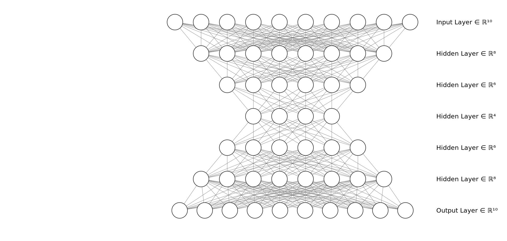

# Fraud detection system

📜  This is a fraud detection sistem that use a ensemble model e a ligth API.

The encoder-decoder DNN 



The input vetcor have the size (sample, 10) and the output (sample, 10), the loss used was
MES (mean squared error), the encoded vector (ʋ) have shape (sample, 5 ou 4).
The architeture of the model have (Final falta)
Here in this file(data_science_challenge_dataset/random_florest_model.ipynb)
is the encoder-decoder model.

With the ʋ we predicte the targert value using a Random Forest Classifier the hyperameter used
is in this file(ata_science_challenge_dataset/random_florest_model.ipynb)

For the API we used the FastAPI. On the localhost/predict we send a header with the values to predict
the input values are:


## Requeriments


## 🛠 To run

OS X & Linux:

```git clone https://github.com/Yuri-MRQ/fraud_detection.git

cd api_fraud_detection

uvicorn main:app --reload

```

Go to http://127.0.0.1:8000/docs

There we can test our system


